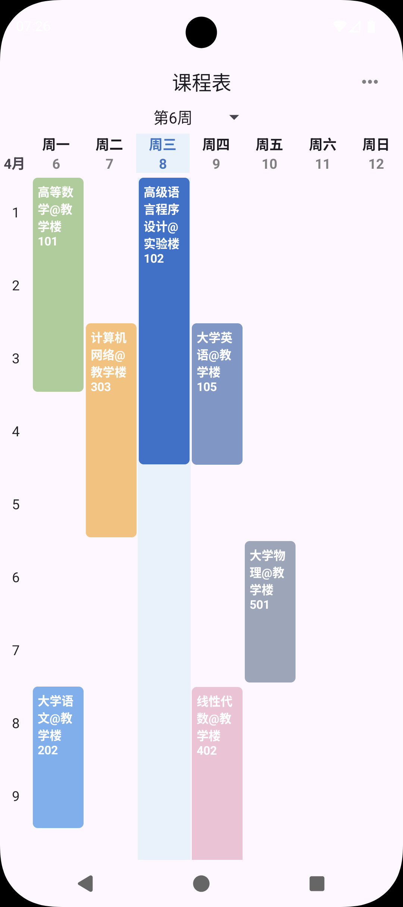
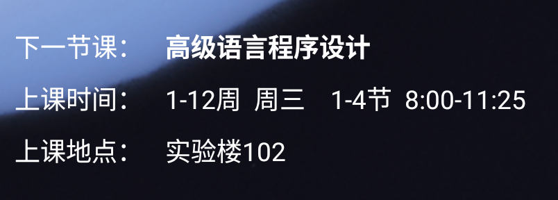
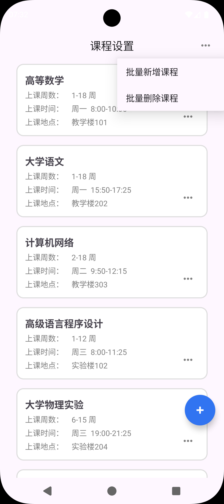
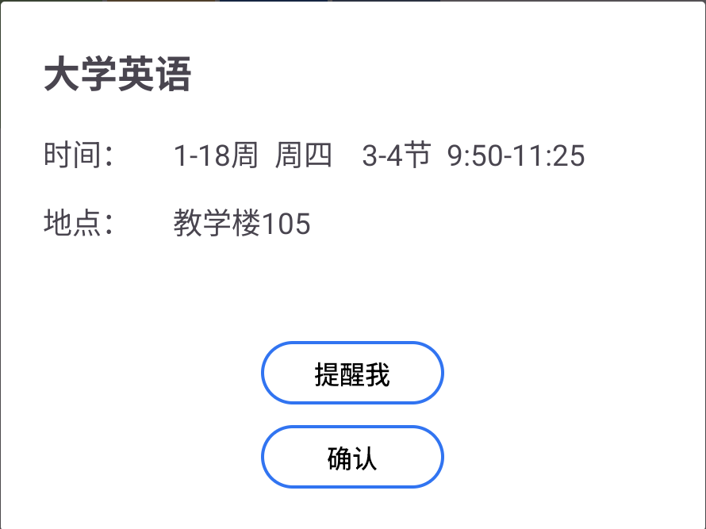
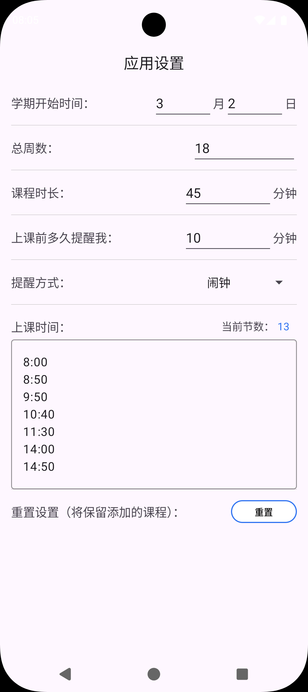

# 课程表
顾名思义，这就是一个课程表app。
 你可以用来查看每天要上的课。
 
  

  
还可以放置桌面小组件，快速查看下一次课。
  

  
它可以方便地查看本学期的所有课程，并可以快速添加。
  

  
你可以给某节课设置上课提醒，在上课前指定时间可以提醒你。 
目前支持日历日程、闹钟、通知三种提醒你的方式。
  

  
你可以方便地自定义各种数据。
  

  
仓库地址：<https://github.com/yourusername/ClassSchedule>
